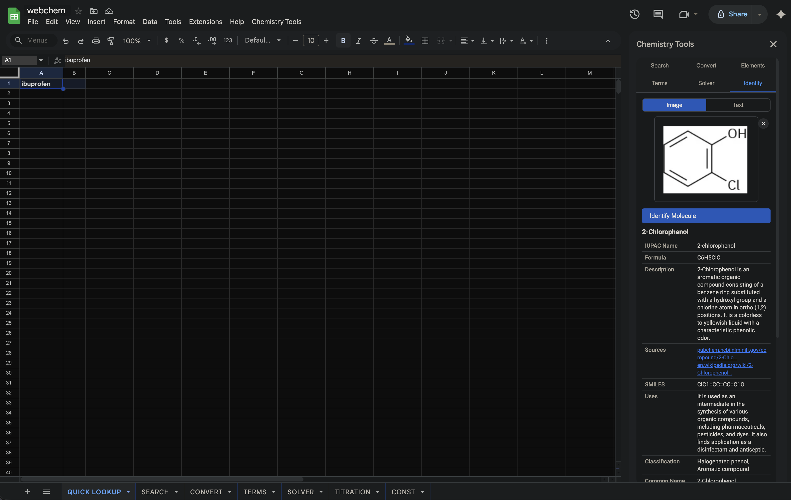
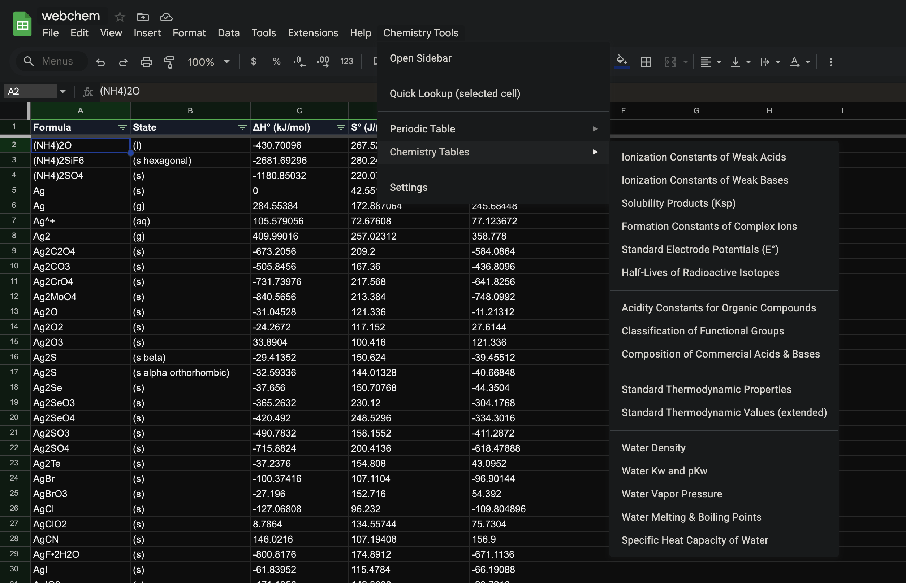
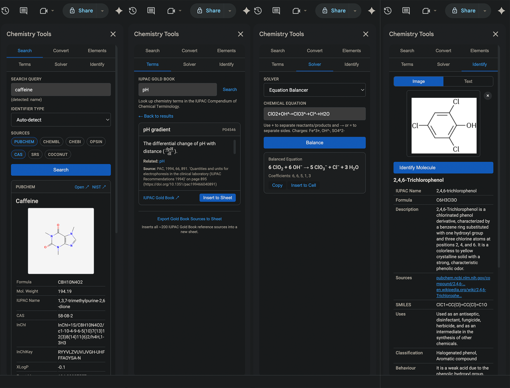

# Chemistry Tools

**Chemistry Data Toolkit for Google Sheets**

**Chemistry Tools** is a Google Apps Script chemistry/chemical data add-on. It offers access to chemistry databases, identifier conversion, equation solvers, AI-powered molecule identification, reference tables, and IUPAC terminology directly inside Google Sheets spreadsheet via a sidebar and custom menu.

> **Status:** In active development. Some features may return incomplete or incorrect results due to limitations of upstream APIs and AI models. Always verify critical data against authoritative sources.

## Features

### Search Tab

Search for chemical compounds across multiple databases simultaneously. Results are displayed as expandable cards with key properties and a structure image (when available). Each result can be injected into the active sheet with a single click.

**Supported databases:**

| Database                 | Source    | Identifier types                                 |
| ------------------------ | --------- | ------------------------------------------------ |
| **PubChem**              | NIH/NLM   | Name, CAS, SMILES, InChI, InChIKey, Formula, CID |
| **ChEMBL**               | EMBL-EBI  | Name, SMILES, InChIKey, ChEMBL ID                |
| **ChEBI**                | EMBL-EBI  | Name, SMILES, InChI, InChIKey, Formula, ChEBI ID |
| **CAS Common Chemistry** | ACS       | Name, CAS                                        |
| **OPSIN**                | Cambridge | IUPAC name → SMILES, InChI, InChIKey             |

- **Auto-detection** of identifier type (CAS, InChIKey, InChI, SMILES, formula, or name)
- **Quick Lookup** from the menu: select a cell containing a chemical name and open the sidebar with results from **Pubchem** pre-loaded
- Cross-resolution via **CTS** (Chemical Translation Service, Fiehn Lab) to translate identifiers between databases
- **NIST WebBook** links are generated alongside each result for quick access to thermochemical data

### Convert Tab

Convert between chemical identifier formats using CTS (Fiehn Lab), CIR (NCI/CADD), and OPSIN services.

| From                                           | To                                                                         |
| ---------------------------------------------- | -------------------------------------------------------------------------- |
| Name, CAS, SMILES, InChI, InChIKey, IUPAC Name | CAS, SMILES, InChI, InChIKey, IUPAC Name, Name, PubChem CID, ChEBI, ChEMBL |

Results can be inserted into the active cell directly.

### Elements Tab (Periodic Table)

Search any element to view detailed information including:

- Atomic number, symbol, name, atomic mass
- Electron configuration, electronegativity, ionisation energy
- Melting/boiling points, density, group, period, block, classification

Element data sourced from PubChem. An option to insert a full periodic table sheet is available from the **Chemistry Tools → Periodic Table** menu.

### Terms Tab (IUPAC Gold Book)

Search and browse chemical terminology from the **IUPAC Gold Book** (Compendium of Chemical Terminology). Terms are rendered with full LaTeX/MathJax support for mathematical formulae and chemical equations (using mhchem).

- Full-text search across the Gold Book index (~7,000 terms)
- Definitions with LaTeX rendering
- Inject term definitions into the sheet
- Inject source references

### Solver Tab

A collection of chemistry calculators and solvers. Select a solver from the dropdown, fill in the inputs, and results are displayed in the sidebar with an option to inject them into the sheet.

**Available solvers:**

| Category             | Solver                | Description                                                                                                                         |
| -------------------- | --------------------- | ----------------------------------------------------------------------------------------------------------------------------------- |
| **General**          | Equation Balancer     | Balance chemical equations using Gaussian elimination                                                                               |
|                      | Molar Mass Calculator | Calculate molar mass from a molecular formula                                                                                       |
|                      | Dilution Calculator   | C₁V₁ = C₂V₂ — solve for any unknown                                                                                                 |
| **Stoichiometry**    | Empirical Formula     | Determine empirical formula from percent composition                                                                                |
|                      | Combustion Analysis   | Determine molecular formula from combustion data (CO₂, H₂O etc. masses)                                                             |
|                      | Theoretical Yield     | Calculate theoretical and percent yield from a balanced equation                                                                    |
| **Thermodynamics**   | Hess's Law            | Calculate ΔH for a target reaction from formation enthalpies                                                                        |
|                      | Ideal Gas Law         | PV = nRT — solve for any variable                                                                                                   |
|                      | Van der Waals         | (P + an²/V²)(V − nb) = nRT — non-ideal gas calculations                                                                             |
| **Equilibrium**      | Dynamic Equilibrium   | Compute Kc, Qc, or equilibrium concentrations for a general equilibrium expression                                                  |
|                      | Solubility / Ksp      | Calculate molar solubility, Ksp, or ion concentrations                                                                              |
|                      | Henry's Law           | Gas solubility: C = kH · P                                                                                                          |
| **Acid–Base**        | Solution pH           | pH of strong/weak acids and bases                                                                                                   |
|                      | Henderson–Hasselbalch | pH = pKa + log([A⁻]/[HA]) — solve for any variable                                                                                  |
|                      | Buffer Solution       | Comprehensive buffer calculator (pH, capacity, dilution, temperature effects)                                                       |
|                      | Titration             | SA–SB, SA–WB, WA–SB, WA–WB, redox and polyprotic titrations with equivalence-point detection and optional titration curve injection |
| **Electrochemistry** | Nernst Equation       | E = E° − (RT/nF) ln Q                                                                                                               |
| **Nuclear**          | Carbon Dating / Decay | Radioactive decay, half-life, carbon-14 dating                                                                                      |

**Titration curve injection:** The titration solver can generate ~115 data points (volume vs. pH) and write them directly into the sheet for plotting.

### Identify Tab

AI-powered molecule identification using the **Google Gemini API** (Gemini 2.5 Flash).

- **Image mode:** Drop or upload an image of a molecular structure → Gemini identifies the molecule and returns structured information
- **Text mode:** Enter a chemical name, formula, SMILES, CAS number, or description → Gemini returns identification results

**Returned fields:** Common name, IUPAC name, SMILES, molecular formula, molecular weight, description, classification, chemical behaviour, properties (mp, bp, density, solubility, pKa), uses, and source links.

Results can be injected into the sheet.

_NOTE: Accuracy of the results can be improved by using a more powerful AI model._

### Chemistry Tables (Menu)

Insert pre-built reference tables into the active sheet from the **Chemistry Tools → Chemistry Tables** menu. Tables are formatted with headers and auto-sized columns.

| Table                                    | Contents                               |
| ---------------------------------------- | -------------------------------------- |
| Ionization Constants of Weak Acids       | Ka values for common weak acids        |
| Ionization Constants of Weak Bases       | Kb values for common weak bases        |
| Solubility Products (Ksp)                | Ksp values for sparingly soluble salts |
| Formation Constants of Complex Ions      | Kf values                              |
| Standard Electrode Potentials (E°)       | Reduction potentials                   |
| Half-Lives of Radioactive Isotopes       | Common radioisotopes                   |
| Acidity Constants for Organic Compounds  | pKa values                             |
| Classification of Functional Groups      | Names, structures, examples            |
| Composition of Commercial Acids & Bases  | Concentrations, densities              |
| Standard Thermodynamic Properties        | ΔHf°, ΔGf°, S°                         |
| Standard Thermodynamic Values (extended) | Extended thermodynamic data            |
| Water Density                            | Density vs. temperature                |
| Water Kw and pKw                         | Kw and pKw vs. temperature             |
| Water Vapor Pressure                     | Vapor pressure vs. temperature         |
| Water Melting & Boiling Points           | At various pressures                   |
| Specific Heat Capacity of Water          | Cp vs. temperature                     |

### Custom Spreadsheet Functions

Custom functions available in any cell:

- **`=CONST("symbol")`** — Return a fundamental physical constant (NIST CODATA 2018). Examples: `=CONST("c")`, `=CONST("Na")`, `=CONST("R")`. Use `=CONST("list")` to see all ~25 available constants with units. Remember to use scientific number formatting in cells to show correct values (otherwise very small values may be shown as zeros).

- **`=CONVERT_INFO()`** — Return a reference table of all units supported by Google Sheets' built-in `CONVERT()` function, with unit codes, names, and usage examples. Use `=CONVERT_INFO("mass")` or `=CONVERT_INFO("temperature")` to filter by category. Categories: Weight, Distance, Time, Pressure, Force, Energy, Power, Magnetism, Temperature, Volume, Area, Information, Speed.

## Setup & Installation

1. Open a Google Sheets spreadsheet.
2. Go to **Extensions → Apps Script**.
3. Copy all `.gs` files from `src/gas/` into the script editor (one file per script file).
4. Copy all `.html` files from `src/html/` into the script editor (**File → New → HTML file**).
5. Copy `src/appsscript.json` (enable **Show manifest file** in Project Settings first).
6. Close the script editor and reload the spreadsheet.
7. A **Chemistry Tools** menu will appear in the menu bar.

### API Keys

Some features require API keys stored in **File → Project Settings → Script Properties**:

| Property         | Required for                                              | How to get                                                               |
| ---------------- | --------------------------------------------------------- | ------------------------------------------------------------------------ |
| `GEMINI_API_KEY` | Identify tab (Gemini AI)                                  | [Google AI Studio](https://aistudio.google.com/app/apikey)               |
| `RSC_API_KEY`    | ChemSpider search                                         | [RSC Developer Portal](https://developer.rsc.org/)                       |
| `CAS_API_KEY`    | CAS Common Chemistry (optional — free tier works without) | [CAS Developer Portal](https://www.cas.org/services/commonchemistry-api) |

The Identify tab will display a warning if the Gemini API key is not configured.

_NOTE: Chemspider API access is currently blocked from Google servers through AWS/Cloudflare, therefore this API cannot be accessed through Google Apps Scripts._

## Usage Tips

- **Quick Lookup:** Select a cell containing a chemical name or CAS number, then use **Chemistry Tools → Quick Lookup** to instantly search **Pubchem** database.
- **Inject to Sheet:** Most results (search, identify, solver, terms) have an "Insert to Sheet" or "Inject to Sheet" button that writes structured data starting at the active cell.
- **Titration Curves:** In the Titration solver, click "Inject Titration Curve" to write volume vs. pH data into the sheet, then insert a chart.
- **Custom Functions:** Type `=CONST("list")` in any cell to see all available physical constants. Type `=CONVERT_INFO()` to see all unit codes for the built-in `CONVERT()` function.
- **Periodic Table:** Use **Chemistry Tools → Periodic Table → Insert Periodic Table** to create a full periodic table sheet.
- **Chemistry Tables:** Use **Chemistry Tools → Chemistry Tables** to insert any of the 16 reference tables at the active cell.

## Notation

The app uses simplified notation for compatibility with plain-text entry in Google Sheets:

| Symbol                      | Meaning                                                            | Example                                           |
| --------------------------- | ------------------------------------------------------------------ | ------------------------------------------------- |
| `=` or `->`                 | Reaction arrow (used for all reaction types, including reversible) | `H2 + O2 = H2O`                                   |
| `^`                         | Charge indicator                                                   | `Na^+`, `SO4^2-`                                  |
| `(s)`, `(l)`, `(g)`, `(aq)` | State of matter                                                    | `H2O(l)`, `NaCl(aq)`                              |
| `v`                         | Stoichiometric coefficient (in some solver contexts)               | Used instead of `n` to avoid confusion with moles |

**Notes:**

- Reversible reactions (⇌) are written with `=` because a double-arrow symbol is impractical to type in spreadsheet cells.
- The coefficient symbol `v` (nu) is used in some solver outputs instead of the more common `n`, because `n` is widely used for amount of substance (moles) in chemistry. The `v` notation follows the convention used in some physical chemistry textbooks.
- These conventions are applied as consistently as possible, though minor variations may occur across different solver outputs and tables.

## Limitations

- **AI Identification (Identify tab):** The Gemini model is not perfect. It may return incorrect, incomplete, or fabricated information — especially for uncommon or complex molecules. Source links (e.g. PubChem URLs) may sometimes be incorrect. Always verify results against authoritative databases using the Search tab or external sources. _Accuracy of the results can be somewhat improved by using a more powerful AI model._
- **Search results:** Only the single most relevant result is returned per database. In rare cases, the top result may not be the intended compound, especially for ambiguous or common names.
- **Identifier conversion:** The Convert tab relies on external services (CTS, CIR, OPSIN) that may not have coverage for all compounds. Conversions may fail silently or return no result.
- **Gold Book terms:** The Gold Book index is fetched and cached from the IUPAC API. Some terms may have incomplete LaTeX rendering or missing cross-references.
- **Titration solver:** Polyprotic titrations use a charge-balance bisection algorithm that is robust but may show minor numerical artefacts at extreme pH values.
- **External API dependencies:** All search, conversion, and terminology features depend on third-party APIs (PubChem, ChEMBL, ChEBI, CAS, CTS, CIR, OPSIN, IUPAC Gold Book). If any upstream service is unavailable, the corresponding feature will not work.
- **Rate limiting:** The app includes built-in rate limiting and caching to respect API usage policies. Rapid successive searches may be slower due to throttling.
- **Gemini API costs:** Gemini 2.5 Flash has a free tier, but heavy usage may incur costs depending on your Google Cloud billing configuration. More advanced models incur more costs.

## Project Structure

```
src/
├── appsscript.json              # Apps Script manifest (V8 runtime)
├── gas/
│   ├── Main.gs                  # Menu, sidebar launcher, search orchestrator
│   ├── Config.gs                # API endpoints, property keys, defaults
│   ├── HttpClient.gs            # Centralized HTTP with retry, caching, rate limiting
│   ├── Validators.gs            # CAS/InChI/SMILES/formula detection & validation
│   ├── SheetUtils.gs            # Sheet injection utilities
│   ├── CustomFunctions.gs       # =CONST() and =CONVERT_INFO() custom functions
│   ├── PubChem.gs               # PubChem PUG REST API integration
│   ├── ChEMBL.gs                # ChEMBL API integration
│   ├── ChEBI.gs                 # ChEBI (via OLS4 API) integration
│   ├── ChemSpider.gs            # ChemSpider / RSC API integration
│   ├── CAS.gs                   # CAS Common Chemistry API integration
│   ├── CIR_CTS.gs               # CIR & CTS identifier conversion services
│   ├── OPSIN.gs                 # OPSIN name-to-structure service
│   ├── GoldBook.gs              # IUPAC Gold Book terminology API
│   ├── GeminiAPI.gs             # Gemini AI molecule identification
│   ├── PeriodicTable.gs         # Periodic table logic & sheet builder
│   ├── PeriodicTableData.gs     # Element data (JSON, sourced from PubChem)
│   ├── Solver.gs                # All chemistry solvers
│   ├── ChemistryTables.gs       # Table injection logic & registry
│   └── ChemistryTableData.gs    # Pre-built reference table data
└── html/
    ├── Sidebar.html             # Main sidebar shell with tab navigation
    ├── Css.html                 # All sidebar CSS styles
    ├── JavaScript.html          # All sidebar JavaScript handlers
    ├── SearchTab.html           # Search tab content
    ├── ConvertTab.html          # Convert tab content
    ├── PeriodicTableTab.html    # Elements (periodic table) tab content
    ├── TerminologyTab.html      # Gold Book terminology tab content
    ├── SolverTab.html           # Solver tab content (all solver panels)
    ├── IdentifyTab.html         # AI identification tab content
    └── SettingsDialog.html      # API key settings modal
```

## Technologies

- **Google Apps Script** (V8 runtime) — server-side logic, API calls, sheet manipulation
- **HTML Service** — sidebar and dialog UI
- **Google Gemini API** (Gemini 2.5 Flash) — AI-powered molecule identification
- **MathJax 3** with mhchem extension — LaTeX rendering for Gold Book terms
- **External APIs:** PubChem, ChEMBL, ChEBI, ChemSpider, CAS Common Chemistry, CTS, CIR, OPSIN, IUPAC Gold Book, Google Gemini API

## Future Development

Potential features for future versions:

- **Additional solvers:** Kinetics (rate laws, Arrhenius equation, Michaelis-Menten, Lineweaver-Burke), colligative properties (boiling point elevation, freezing point depression, osmotic pressure), electrochemistry (electrolysis, Faraday's laws), molecular orbital theory calculations, biochemistry
- **More databases:** NIST Chemistry WebBook integration (retention indices, IR/MS spectra), DrugBank, UniChem
- **Unit conversion tables:** Injectable tables of common unit conversions for chemistry (moles ↔ grams, pressure units, energy units, etc.)
- **Batch operations:** Search/convert multiple compounds at once from a column of identifiers
- **Structure drawing:** Integration with a molecular editor (e.g. Ketcher or JSME) for drawing and searching structures
- **Spectra viewer:** Display and annotate IR, NMR, or mass spectra from NIST or other sources
- **More reference tables:** Amino acids, nucleotides, common solvents, indicator pH ranges
- **Offline mode:** Cache frequently used data locally for faster access

## Screenshots

**Main view**

**Menu Bar**

**Side bar**


Walkthrough of the app is available [here](https://youtu.be/EWGGI01j9IQ).

## License

MIT License, restricted commercial use.

Note that this project is currently in development.

## Acknowledgements

- [PubChem](https://pubchem.ncbi.nlm.nih.gov/) (NIH/NLM) — compound data and element properties
- [ChEMBL](https://www.ebi.ac.uk/chembl/) (EMBL-EBI) — bioactive molecule data
- [ChEBI](https://www.ebi.ac.uk/chebi/) (EMBL-EBI) — chemical entities of biological interest
- [CAS Common Chemistry](https://commonchemistry.cas.org/) (American Chemical Society) — CAS Registry data
- [ChemSpider](https://www.chemspider.com/) (Royal Society of Chemistry) — chemical structure database
- [CTS](https://cts.fiehnlab.ucdavis.edu/) (Fiehn Lab, UC Davis) — Chemical Translation Service
- [CIR](https://cactus.nci.nih.gov/chemical/structure) (NCI/CADD) — Chemical Identifier Resolver
- [OPSIN](https://opsin.ch.cam.ac.uk/) (University of Cambridge) — Open Parser for Systematic IUPAC Nomenclature
- [IUPAC Gold Book](https://goldbook.iupac.org/) — Compendium of Chemical Terminology
- [Google Gemini API](https://ai.google.dev/) — AI molecule identification
- [MathJax](https://www.mathjax.org/) — LaTeX rendering
- [NIST CODATA](https://physics.nist.gov/cuu/Constants/) — Fundamental physical constants
